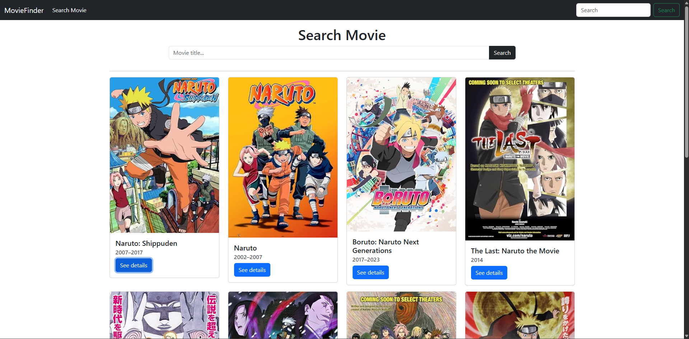

# 🎬 Movie Finder

A simple web application for searching movies based on keywords using the **OMDb Public API**.  
Type any movie title in the search bar and instantly get movie details such as poster, release year, genre, and more.
- visit site: https://edward-shandy.github.io/movie-finder/
- reference: https://www.omdbapi.com/

---

## 🔍 Features
- Search movies by keyword  
- Display movie poster & basic details  
- Lightweight and easy to use  
- Powered by OMDb API (public API)

---

## 🖼️ Screenshot

