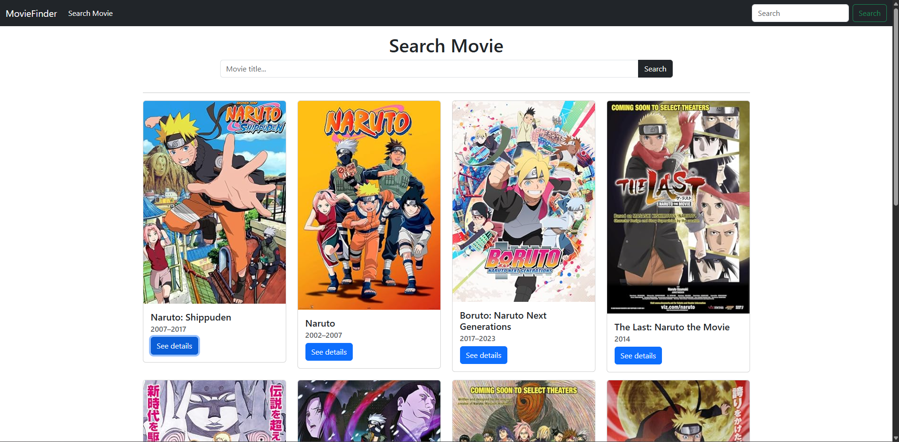

# 🔴 MovieDex

A movie finder styled like a **Pokédex**. You don't just search — you *scan* the database and *log entries*. Type a title, and every result is catalogued like a Pokédex entry, complete with a wobbling 3D Poké Ball, type-coloured genre badges, and HP-style rating bars.

Built on the free **[OMDb API](https://www.omdbapi.com/)**.

- **Live site:** https://edward-shandy.github.io/movie-finder/
- **Data:** https://www.omdbapi.com/

> A fan-made tribute. Not affiliated with, endorsed by, or sponsored by Nintendo, Game Freak, or The Pokémon Company.

---

## ✨ Features

- **Scan to search** — query the OMDb catalogue and log results as numbered entries (`#001`, `#002`, …)
- **3D Poké Ball hero** — a glossy `three.js` ball that idly spins and **wobbles like a catch animation** on every search
- **Pokédex-style detail view** — poster, type-coloured genre pills, IMDb rating as an **HP-style stat bar**, and the plot shown on a scan-line "device screen"
- **Night Pokédex (dark mode)** — toggle in the header, remembers your choice, and follows your system setting by default
- **Infinite scroll** — results load 10 at a time as you scroll, with a running `N / total logged` counter
- **Responsive** — from wide desktop down to mobile
- **Accessible** — keyboard focus states and `prefers-reduced-motion` support

---

## 🕹️ Tech

- Vanilla JavaScript + `fetch` (no framework, no jQuery)
- Custom CSS design system — `Fredoka` / `DM Sans` / `VT323`
- [three.js](https://threejs.org/) for the 3D Poké Ball
- [GSAP](https://gsap.com/) for the catch-wobble and staggered reveals
- [OMDb API](https://www.omdbapi.com/) for movie data

```
movie-finder/
├── index.html
├── css/
│   └── style.css
└── js/
    ├── app.js        # search, pagination, modal, theme toggle
    └── pokeball.js   # three.js Poké Ball
```

---

## ▶️ Run it locally

No build step. Everything loads over CDN, so you can just:

**Option A — double-click**
Open `index.html` in your browser. All scripts are loaded as classic scripts (no ES modules), so the 3D Poké Ball works even from `file://`.

**Option B — local server** (recommended)
```bash
# Python
python -m http.server 5500
# then open http://localhost:5500

# or VS Code: right-click index.html → "Open with Live Server"
```

> An internet connection is required — three.js, GSAP, the fonts, and movie data are all fetched online.

---

## 🖼️ Screenshot



> _Note: replace `assets/image-1.png` with a fresh capture of the new Pokédex design._
